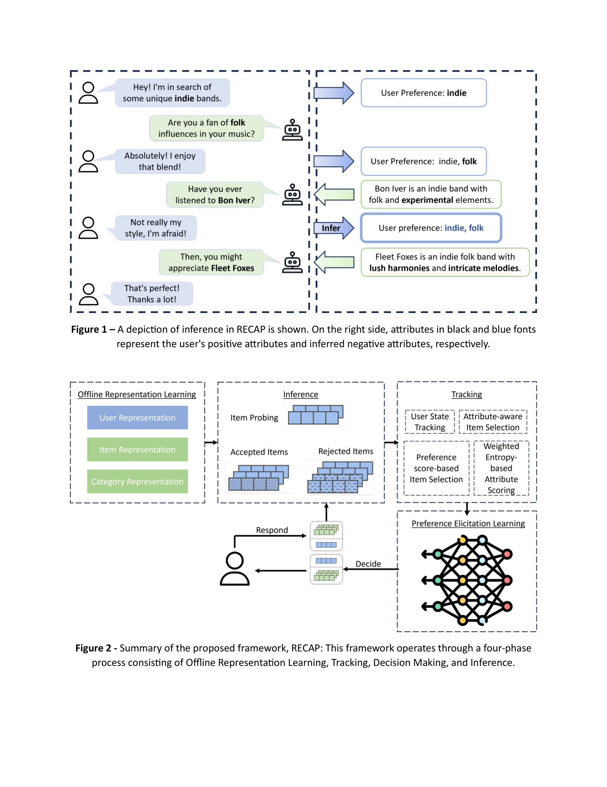

# RECAP: Recommender Enhancement through Conversational Adaptive Preferences

## Introduction
Welcome to RECAP! This project is dedicated to advancing recommender systems by utilizing implicit feedback from conversational agent interactions, all while maintaining user anonymity. Our aim is to enhance how conversational agents understand and predict user preferences in real-time, ensuring a personalized and engaging user experience.

## Objectives
- Advance Preference Elicitation: Develop innovative methods to extract and leverage subtle cues from user-agent dialogues, improving the personalization of agent responses.
- Evaluate User Acceptance: Investigate user acceptance levels of traditional and novel recommendation algorithms when integrated with cutting-edge generative models, aiming to identify the most effective preference elicitation strategies.
- Enhance Content Discovery and Fairness: Explore the impact of recommendation algorithms on content relevance and item fairness, using novel large language models to uncover user's latent preferences for more accurate content discovery.

## Open-Source Commitment
RECAP is committed to open-source principles. We provide the research community with access to our code and methods, fostering transparency, reproducibility, and further exploration of algorithmic biases.

## Installation and Usage
(TODO: Add installation instructions and usage examples)

## Contributions
We welcome contributions from the community! 

## License
This project is licensed under the [Mit License](LICENSE.md) - see the LICENSE.md file for details.

## Contact
For inquiries, please contact [info@preferai.hr](mailto:info@preferai.hr).

Web: [https://preferai.hr/](https://preferai.hr/)

Thank you for your interest in RECAP
